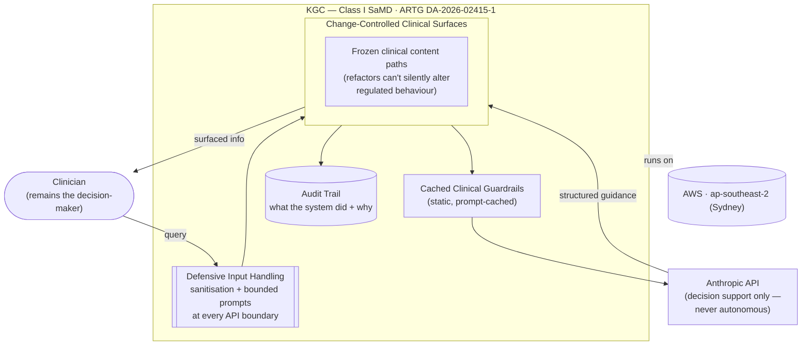

# KGC — TGA Class I Clinical Decision Support

KGC is a clinical decision-support platform registered with Australia's Therapeutic Goods Administration as a Class I Software as a Medical Device (ARTG DA-2026-02415-1). Building an LLM-powered system that qualifies as a regulated medical device reframes every architectural choice around a single question the TGA will eventually ask: *can you prove this system behaves safely and predictably?* The answer can't be retrofitted, so safety, traceability, and a defensible scope of intended use were designed in from the first commit rather than bolted on before audit.

Clinical safety in an LLM-powered system is maintained by keeping the model firmly in a *support* role and never an autonomous decision-maker. The product's intended use is scoped to decision support — surfacing information and structured guidance to a clinician who remains the decision-maker — which is what keeps it within the Class I risk classification. Around the model sit guardrails appropriate to a clinical context: bounded prompts, input sanitisation at every API boundary, and clinical content paths that are frozen and change-controlled so a refactor can't silently alter regulated behaviour. The platform runs on AWS in the ap-southeast-2 (Sydney) region and uses the Anthropic API for its language-model capability, with prompt-caching of the static clinical guardrails to keep latency and cost predictable.

The TGA audit pathway is treated as a first-class requirement, not an afterthought. That means an auditable trail of what the system did and why, change-control discipline over clinical surfaces, and a documented compliance posture aligned with the obligations that attach to a registered device and to Australian private-health-information handling. The genuinely hard part isn't wiring an LLM to a UI — it's doing so under a regulatory regime where "it usually works" is not an acceptable standard, and demonstrating that a probabilistic system can be operated within deterministic safety bounds.
