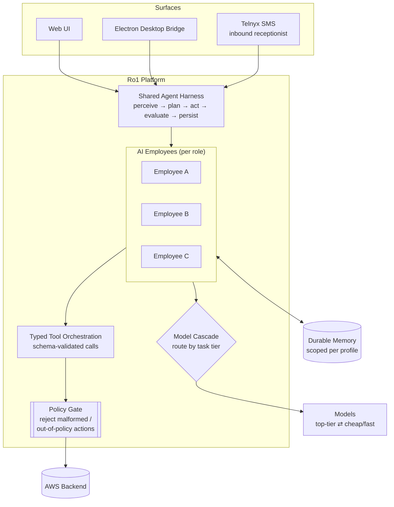

# Ro1 — Multi-Agent AI Employee Platform

Ro1 is an agent platform that behaves less like a chatbot and more like a small team of AI employees: each one holds a defined role, carries persistent memory across sessions, and executes multi-step tasks autonomously rather than waiting for turn-by-turn instruction. The central architectural bet was to treat an "AI employee" as a long-lived stateful entity — with its own memory, tools, and accountability — instead of a stateless prompt. That framing drove every downstream decision: how state is persisted between conversations, how an agent decides which tool to reach for, and how the system stays observable when work runs without a human watching each step.

The agent framework is built on a shared harness that standardises the loop every employee runs — perceive, plan, act via tools, evaluate, persist — so behaviour is consistent and testable across roles rather than re-implemented per agent. Tool orchestration is structured: agents emit typed, schema-validated tool calls rather than free-text, which keeps autonomous execution bounded and auditable and lets the platform reject malformed or out-of-policy actions before they run. Models are selected by task tier (a cascade from a top-tier model for judgment-heavy reasoning down to cheaper, faster models for routine steps), so cost tracks the difficulty of the work instead of paying premium rates for every token. Memory is durable and scoped per profile, letting an employee accumulate context about its domain over time the way a human hire would.

The platform reaches beyond the browser. An Electron desktop bridge gives agents a presence on the user's machine, and a Telnyx SMS integration lets an agent receive and respond to real phone messages — turning it into, for example, an inbound receptionist working from a defined script. The backend runs on AWS. The hard problems Ro1 solves are the ones that show up only once agents act on their own: keeping autonomous task execution reliable, bounding what an agent is permitted to do, recovering gracefully from failed steps, and making the whole thing legible to a human reviewing what happened after the fact.
